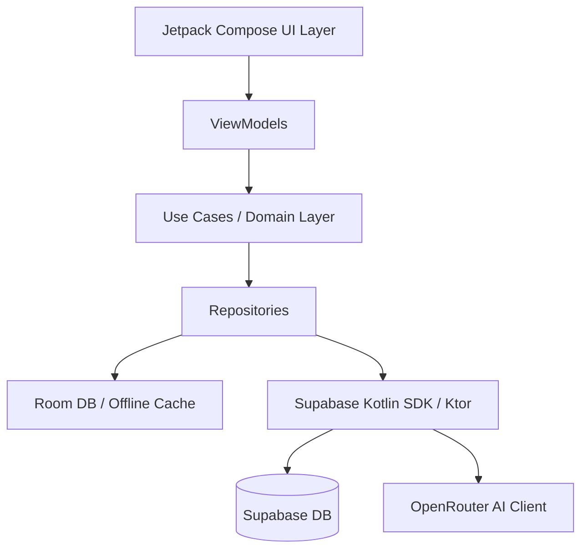
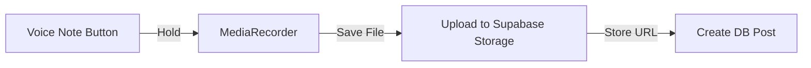
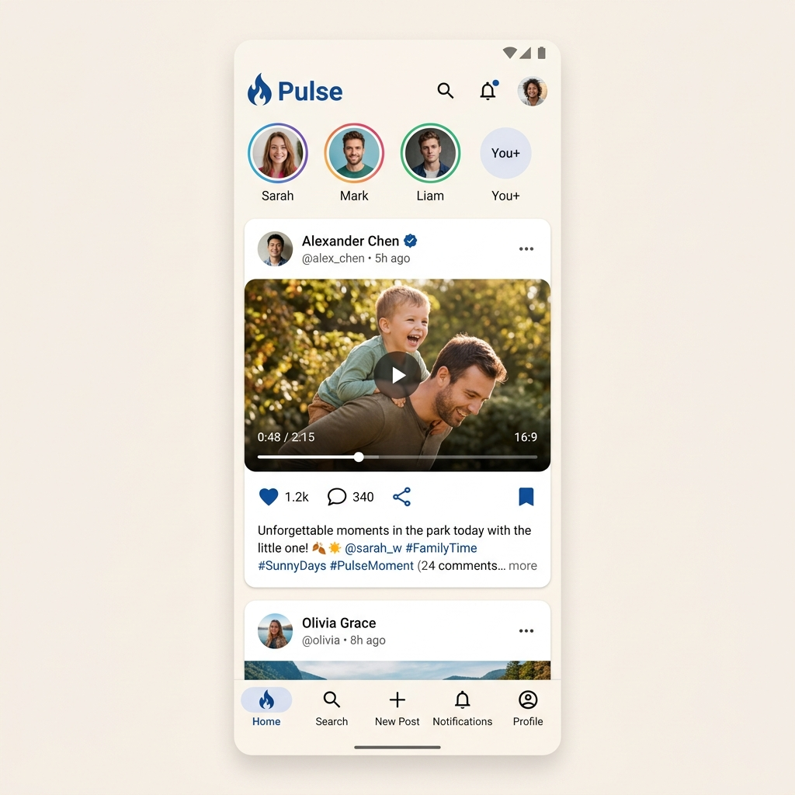
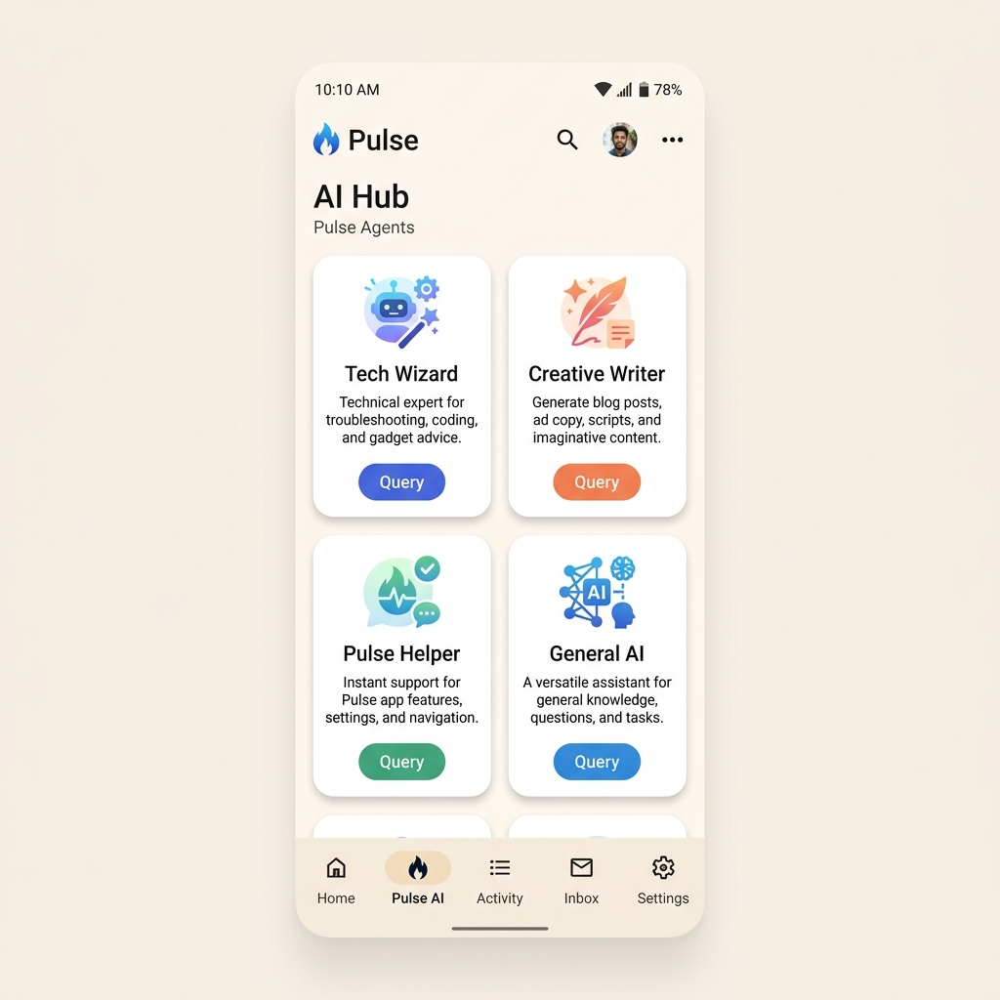

# Pulse Social: Native Android Architectural Blueprint & Implementation Guide

This document defines the architectural blueprint and implementation details for porting the React/TypeScript **Pulse Social** web application (located in the `peer-stream` directory) into a premium, native Android application. 

The Android app will target the custom **Warm Light Theme** (matching the web platform's active theme: cream/beige `#F5F0EA` background, elevated white rounded cards with soft shadows, dark charcoal text, and blue flame branding details), utilizing modern Native Android technologies (Kotlin, Jetpack Compose, Coroutines, Room DB, Hilt) and directly integrate with the existing Supabase backend and OpenRouter AI engines configured in the web app's `.env` file.

---

## 1. Executive Summary & Alignment

**Pulse Social** is a rich, dynamic social platform featuring multimedia posts (audio, video, images), nested commenting, real-time messaging, direct user actions (likes, follows, blocks, mutes), expiring stories, custom reactions, and an interactive **AI Hub** (powered by OpenRouter).

Our objective is to build a native Android app in the `Android/` directory that:
1. Matches the capabilities of the React frontend in `peer-stream`.
2. Leverages the **same Supabase DB & Auth** endpoints.
3. Implements offline-first caching for smooth scrolling and instant data retrieval.
4. Uses **Jetpack Compose** to replicate shadcn-ui/Framer Motion-style glassmorphism and micro-animations.

---

## 2. Tech Stack & Architecture

To achieve peak performance and visual richness, the Android app will use the following technology stack:



### Stack Components:
*   **Language**: Kotlin (1.9+) with Coroutines and Flows for structured concurrency and reactive data piping.
*   **Architecture**: Clean Architecture + MVVM (Model-View-ViewModel) + MVI (Model-View-Intent) pattern for UI state representation.
*   **UI Framework**: Jetpack Compose (Modern Declarative UI) + Navigation Compose + Coil (for image loading).
*   **Dependency Injection**: Hilt / Dagger for compile-time clean DI.
*   **Database & Cache**: Room DB (SQLite wrapper) acting as the single source of truth for offline-first capabilities.
*   **Network & Realtime**:
    *   **Supabase Kotlin Client** (`io.supabase`: `postgrest-kt`, `gotrue-kt`, `realtime-kt`, `storage-kt`).
    *   **Ktor Client** for OpenRouter Server-Sent Events (SSE) chat streaming.
*   **Media Pipeline**:
    *   **Media3/ExoPlayer** for high-performance Reels video rendering.
    *   **Android MediaPlayer / MediaRecorder** for voice notes.

---

## 3. Environment & Supabase Configuration

The Android application will ingest configuration from the same Supabase database. We will store these configurations securely in Gradle using `secrets-gradle-plugin` or `local.properties` to avoid hardcoding.

### Configuration Variables (`peer-stream/.env` mappings):

```ini
VITE_SUPABASE_PROJECT_ID="auwbveyhrhowzmwmvhhc"
VITE_SUPABASE_URL="https://auwbveyhrhowzmwmvhhc.supabase.co"
VITE_SUPABASE_PUBLISHABLE_KEY="eyJhbGciOiJIUzI1NiIsInR5cCI6IkpXVCJ9..."
VITE_Open_Router="sk-or-v1-9e98..."
```

### Kotlin SDK Initialization (`di/NetworkModule.kt`):

```kotlin
@Module
@InstallIn(SingletonComponent::class)
object NetworkModule {

    @Provides
    @Singleton
    fun provideSupabaseClient(): SupabaseClient {
        return createSupabaseClient(
            supabaseUrl = BuildConfig.SUPABASE_URL,
            supabaseKey = BuildConfig.SUPABASE_KEY
        ) {
            install(Auth) {
                // Persistent Session storage using EncryptedSharedPreferences
                sessionManager = AndroidSettingsSessionManager(context) 
            }
            install(Postgrest)
            install(Realtime)
            install(Storage)
        }
    }
    
    @Provides
    @Singleton
    fun provideKtorClient(): HttpClient {
        return HttpClient(OkHttp) {
            install(ContentNegotiation) {
                json(Json { ignoreUnknownKeys = true })
            }
            install(HttpTimeout) {
                requestTimeoutMillis = 60000
            }
        }
    }
}
```

---

## 4. Supabase Database Schema & Room Entity Mapping

To enable offline-first usage, Room entities will reflect the structure of the Supabase PostgreSQL database defined in types.ts.

Here are the key Room database models to be created on Android:

### A. Profiles Entity (`data/local/entities/ProfileEntity.kt`)
Represents the `profiles` table:
```kotlin
@Entity(tableName = "profiles")
data class ProfileEntity(
    @PrimaryKey val id: String,
    val userId: String,
    val username: String?,
    val displayName: String?,
    val fullName: String?,
    val avatarUrl: String?,
    val coverUrl: String?,
    val bio: String?,
    val isPrivate: Boolean = false,
    val isVerified: Boolean = false,
    val dateOfBirth: String?,
    val gender: String?,
    val phone: String?,
    val pinnedPostId: String?,
    val createdAt: String,
    val updatedAt: String
)
```

### B. Posts Entity (`data/local/entities/PostEntity.kt`)
Represents the `posts` table supporting text, images, audio, and video:
```kotlin
@Entity(tableName = "posts")
data class PostEntity(
    @PrimaryKey val id: String,
    val userId: String,
    val content: String,
    val type: String, // "text", "image", "audio", "video", "reels"
    val imageUrl: String?,
    val audioUrl: String?,
    val videoUrl: String?,
    val quotedPostId: String?,
    val isFlagged: Boolean = false,
    val createdAt: String,
    val scheduledAt: String?
)
```

### C. Direct Messages Entity (`data/local/entities/MessageEntity.kt`)
Represents the `messages` table:
```kotlin
@Entity(tableName = "messages")
data class MessageEntity(
    @PrimaryKey val id: String,
    val senderId: String,
    val receiverId: String,
    val content: String,
    val read: Boolean = false,
    val createdAt: String
)
```

### D. Offline Drafts Entity (`data/local/entities/DraftEntity.kt`)
Represents local post creation drafts:
```kotlin
@Entity(tableName = "drafts")
data class DraftEntity(
    @PrimaryKey(autoGenerate = true) val localId: Int = 0,
    val content: String,
    val mediaPaths: String, // JSON Array string for local image/video URIs
    val pollQuestion: String?,
    val pollOptions: String?, // JSON Array string
    val updatedAt: Long
)
```

---

## 5. Screen-by-Screen Architecture & Compose Layout

We will translate the React routing architecture defined in App.tsx into a Native Navigation Graph:

### 1. Authentication (`AuthScreen.kt`)
*   **React Reference**: Auth.tsx
*   **Compose Elements**: OutlinedTextFields with custom border states, password toggles, social login buttons (Google, Apple).
*   **Logic**: Connects to `supabase.auth.signInWith(Email)` and `signUpWith(Email)`. Handles JWT storage in Android Keystore-backed shared preferences.

### 2. Main Social Feed (`FeedScreen.kt`)
*   **React Reference**: Feed.tsx
*   **Compose Elements**: `LazyColumn` for scroll performance. Integrated Pull-to-Refresh (`PullToRefreshBox` from material3). Post cards with inline media attachment players.
*   **Logic**: Uses Android Paging 3 library (`Pager` + `RemoteMediator`) to sync post data from Supabase into the local Room database, providing an instant offline loading experience.

### 3. Short Videos / Reels Screen (`ReelsScreen.kt`)
*   **React Reference**: Reels.tsx
*   **Compose Elements**: A vertical pager (`VerticalPager`) containing ExoPlayer components.
*   **Logic**: ExoPlayer caching instance ensures upcoming video reels pre-buffer before the user scrolls, avoiding delay.

### 4. Chatting & AI Hub (`AIHubScreen.kt` & `AIChatDialog.kt`)
*   **React Reference**: AIHub.tsx & AIAssistant.tsx
*   **Compose Elements**: Agent selection grid (Tech Wizard, Creative Writer, Pulse Helper, General AI). Ambient glows matching the unique gradient colors of each agent.
*   **Logic**: Consumes OpenRouter API via Ktor Client to stream answers chunk by chunk using Kotlin Flows, directly matching the web's Server-Sent Events implementation.

---

## 6. Premium Warm Cream Design Tokens (Compose)

Pulse Social implements a clean **Warm Light/Cream Theme** as the default style. We will define the custom Material 3 Compose theme tokens and card modifiers in Kotlin:

```kotlin
// Theme Color Definitions
val WarmCreamBackground = Color(0xFFF5F0EA) // Screen background
val CardWhiteBackground = Color(0xFFFFFFFF) // Post cards background
val TextCharcoal = Color(0xFF1C1917)       // Primary text color
val TextMutedGray = Color(0xFF78716C)      // Subtitles and metadata
val PulseBlueAccent = Color(0xFF3B82F6)    // Interaction buttons & branding blue

@Composable
fun Modifier.warmCardStyle(
    elevation: Dp = 4.dp
): Modifier = this
    .background(
        color = CardWhiteBackground,
        shape = RoundedCornerShape(20.dp)
    )
    .shadow(
        elevation = elevation,
        shape = RoundedCornerShape(20.dp),
        ambientColor = Color(0xFF1C1917).copy(alpha = 0.04f),
        spotColor = Color(0xFF1C1917).copy(alpha = 0.08f)
    )
    .padding(16.dp)
```

---

## 7. OpenRouter SSE Streaming in Kotlin

To fetch streaming chat completions from OpenRouter directly:

```kotlin
class OpenRouterRepository @Inject constructor(
    private val client: HttpClient
) {
    fun streamChat(
        messages: List<ChatMessage>,
        agentModel: String,
        systemPrompt: String?
    ): Flow<String> = flow {
        val payload = buildJsonObject {
            put("model", agentModel)
            put("messages", buildJsonArray {
                systemPrompt?.let {
                    add(buildJsonObject {
                        put("role", "system")
                        put("content", it)
                    })
                }
                messages.forEach { msg ->
                    add(buildJsonObject {
                        put("role", msg.role)
                        put("content", msg.content)
                    })
                }
            })
            put("stream", true)
        }

        client.preparePost("https://openrouter.ai/api/v1/chat/completions") {
            header(HttpHeaders.Authorization, "Bearer ${BuildConfig.OPEN_ROUTER_API_KEY}")
            header(HttpHeaders.ContentType, "application/json")
            setBody(payload)
        }.execute { response ->
            val channel = response.bodyAsChannel()
            while (!channel.isClosedForRead) {
                val line = channel.readUTF8Line() ?: break
                if (line.startsWith("data: ")) {
                    val data = line.removePrefix("data: ").trim()
                    if (data == "[DONE]") break
                    try {
                        val element = Json.parseToJsonElement(data).jsonObject
                        val deltaContent = element["choices"]
                            ?.jsonArray?.firstOrNull()
                            ?.jsonObject?.get("delta")
                            ?.jsonObject?.get("content")
                            ?.jsonPrimitive?.content ?: ""
                        if (deltaContent.isNotEmpty()) {
                            emit(deltaContent)
                        }
                    } catch (e: Exception) {
                        // Ignore SSE malformed blocks
                    }
                }
            }
        }
    }
}
```

---

## 8. Real-time Notifications & Presence Architecture

For real-time functionality, the Android app will use Supabase WebSockets channels:

### A. Presence & Typing Indicator
Uses `supabase.realtime` channels to broadcast online state and recipient typing details:
```kotlin
val presenceChannel = supabase.realtime.createChannel("global-presence")

// Subscribing to Presence
presenceChannel.presenceEvents()
    .onEach { event ->
        val onlineUsers = event.state.keys
        // Update presence states inside UI
    }.launchIn(viewModelScope)

// Track user state
presenceChannel.track(
    buildJsonObject {
        put("user_id", currentUserId)
        put("online_at", Clock.System.now().toString())
        put("typing_to", typingRecipientId)
    }
)
```

### B. Push Notifications
*   **Foreground Mode**: Subscribes to the database listener channel matching the current `user_id` inside the `notifications` table. Triggers local Android notifications directly using `NotificationManagerCompat`.
*   **Background Mode**: Utilizes a Supabase Trigger function to send a POST request to Firebase Cloud Messaging (FCM) when a row is inserted in `public.notifications`. The client handles this via `FirebaseMessagingService`.

---

## 9. Audio & Video Multimedia Pipeline



*   **Audio Recording**: Compresses audio into AAC/AMR container formats using standard `MediaRecorder` API. High-pass filter implemented locally to reduce background noise.
*   **Audio Playback**: Uses an ExoPlayer instance linked to custom compose progress bars.
*   **Video Posts**: ExoPlayer linked to Compose Surface views with configurable aspect ratio constraints.

---

## 10. Step-by-Step Implementation Roadmap

```
┌─────────────────────────────────────────────────────────────┐
│ PHASE 1: Project Setup & DI                                 │
│ - Initialize Jetpack Compose Empty Project                  │
│ - Configure Gradle with Supabase & OpenRouter secrets       │
│ - Setup Room Entities and Hilt DI Module                    │
└──────────────────────────────┬──────────────────────────────┘
                               │
                               ▼
┌─────────────────────────────────────────────────────────────┐
│ PHASE 2: Auth & User Profile                                │
│ - Implement Email Register, Login & Password recovery       │
│ - Build Profile Management, image picking & storage uploads │
└──────────────────────────────┬──────────────────────────────┘
                               │
                               ▼
┌─────────────────────────────────────────────────────────────┐
│ PHASE 3: Core Social Feed & Media                           │
│ - Implement Paging 3 feed caching to Room Database          │
│ - Add ExoPlayer Reels video pager & custom Audio Player     │
└──────────────────────────────┬──────────────────────────────┘
                               │
                               ▼
┌─────────────────────────────────────────────────────────────┐
│ PHASE 4: Presence & Messages                                │
│ - Connect Realtime presence channel and typing state        │
│ - Establish Direct Messages instant synchronizer            │
└──────────────────────────────┬──────────────────────────────┘
                               │
                               ▼
┌─────────────────────────────────────────────────────────────┐
│ PHASE 5: OpenRouter AI Hub                                  │
│ - Build SSE Event parser stream flow                        │
│ - Design responsive chat bubbles and agent details layout    │
└─────────────────────────────────────────────────────────────┘
```

---

## 11. Verification Plan

*   **Offline Operation**: Turn off cellular data/Wi-Fi. Verify that cached feeds, posts, drafts, and profile screens populate correctly from the Room database.
*   **AI Speed & Streaming**: Monitor memory allocations during Server-Sent Events token parsing. Ensure there are no UI lags on the compose screen during fast responses.
*   **Presence Latency**: Confirm typing indicators disappear within 2 seconds of stopping keyboard inputs.

---

## 12. Visual Design & Android UI Mockups (Warm Theme)

To bridge the gap between the web app's look-and-feel and a native Android application, we have modeled the key user flows using high-fidelity Android mockups. These designs are fully realized in Jetpack Compose utilizing the modern **Warm Cream Theme** style (soft cream `#F5F0EA` backgrounds, elevated card structures, clean dark charcoal typography, and branding accents):

````carousel

<!-- slide -->

````

*   **Feed UI Mockup (Slide 1)** shows how the main feed feed list (with rounded card borders, user details, video posts matching the screenshot, custom likes/comments, and action grids) is rendered on Android.
*   **AI Hub Mockup (Slide 2)** illustrates the agent grid (Tech Wizard, Creative Writer, Pulse Helper, General AI) rendered as elevated clean cards with light ambient borders, fitting the light-mode theme.

